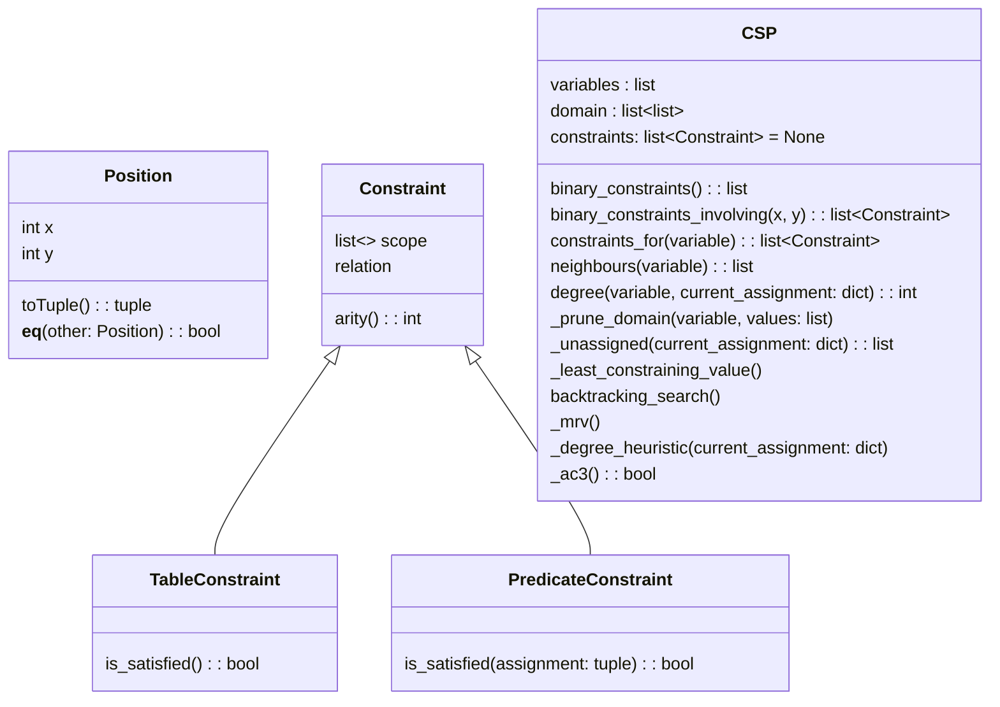

# UML for CSP 

```mermaid
classDiagram
    class Position {
        int x
        int y

        toTuple() : tuple
        __eq__(other: Position) : bool
    }

    class Constraint {
        list~~ scope
        relation

        arity() : int
    }
    
    class TableConstraint{
        is_satisfied() : bool
    }

    Constraint <|-- TableConstraint

    class PredicateConstraint{
        is_satisfied(assignment: tuple) : bool
    }

    Constraint <|-- PredicateConstraint

    class CSP {
        variables : list 
        domain : list~list~
        constraints: list~Constraint~ = None
        
        binary_constraints() : list
        binary_constraints_involving(x, y) : list~Constraint~

        constraints_for(variable) : list~Constraint~

        neighbours(variable) : list

        degree(variable, current_assignment: dict) : int
        
        _prune_domain(variable, values: list)

        _unassigned(current_assignment: dict) : list 

        _least_constraining_value()

        backtracking_search()

        _mrv()

        _degree_heuristic(current_assignment: dict)

        _ac3() : bool
    }

```