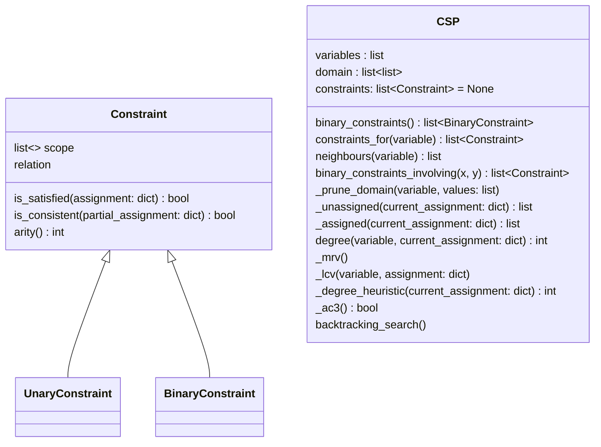
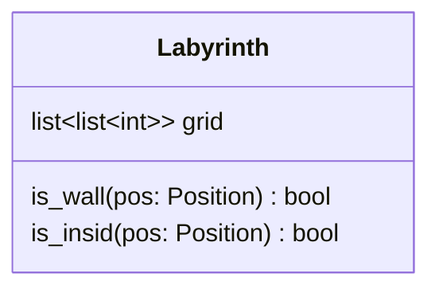

# UML for CSP 

```mermaid
classDiagram

    class Constraint {
        list~~ scope
        relation

        is_satisfied(assignment: dict) bool
        is_consistent(partial_assignment: dict) bool

        arity() int
    }
    
    class UnaryConstraint{

        }

    Constraint <|-- UnaryConstraint

    class BinaryConstraint{
        
    }

    Constraint <|-- BinaryConstraint

    class CSP {
        variables : list 
        domain : list~list~
        constraints: list~Constraint~ = None

        binary_constraints() list~BinaryConstraint~

        constraints_for(variable) list~Constraint~
        
        neighbours(variable) list
        
        binary_constraints_involving(x, y) list~Constraint~

        _prune_domain(variable, values: list)

        _unassigned(current_assignment: dict) list

        _assigned(current_assignment: dict) list 

        degree(variable, current_assignment: dict) int
        
        _mrv()

        

        _lcv(variable, assignment: dict) 

        _degree_heuristic(current_assignment: dict) int

        _ac3() bool

        backtracking_search()
    }

```

# UML for Searching 

```mermaid
classDiagram
    class Labyrinth {
        list~list~int~~ grid

        is_wall(pos: Position) bool

        is_insid(pos: Position) bool  

    }
```
